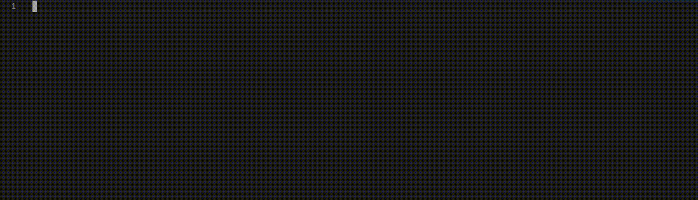

# ts2gd: Compile TypeScript to GDScript

⚠️ Need help? Contact me on Discord: johnfn#0001.

## Why use ts2gd?

- Compiles directly to GDScript with virtually no performance penalty - no embedded JS runtime.
- Insanely fast dev experience - after startup, incremental compiles take under a tenth of a second.
- Provides crazy good autocomplete and documentation.
- Use all of TS's extremely powerful type system.

## Install:

`npm install --global ts2gd`

Then just run `ts2gd` in your favorite Godot project folder.



## Why?

GDScript is a great language - it's perfectly designed for quick prototyping. But it lacks the type-safety and maturity of a language like TypeScript. By compiling TS into GD, we can get the best of both worlds: a rapid prototyping language that compiles virtually instantaneously, that also comes with excellent typesafety.

We can also get really, really good autocomplete and refactoring support.

## Usage

To initialize a new project:

```
ts2gd --init
```

To watch TS files for changes and automatically compile them to GDScript:

`ts2gd`

To compile all source files once:

`ts2gd --buildOnly`

## Windows

ts2gd should run on GNU/Linux, Mac OS and Windows. If you run into issues, please fill a ticket.

Development of ts2gd makes use of symlinks within the repository, thus when cloning on windows, clone with:

```
git clone -c core.symlinks=true --recurse-submodules git@github.com:johnfn/ts2gd.git
```

## Details and Differences

### `get_node`

`get_node` has been supercharged - it will now autocomplete the names of all
child nodes. And yes, this means that if you arrange your nodes later, you'll
get type errors if you break any `get_node` calls!!

|        Godot hierarchy         |          ts2gd autocomplete           |
| :----------------------------: | :-----------------------------------: |
|  |  |

ts2gd also provides a way to get any node by name, even the ones it can't verify exist:

```
this.get_node<Label>("MyLabel")
```

N.B. It _should_ be possible to use ts2gd without _ever_ having to revert to the
second get_node call with the type parameter. Please open a GitHub issue if you
feel this isn't the case.

### `load` / `preload`

`preload` and `load` work as normal - plus they have good autocomplete support, and they return the proper type of the thing you're loading.

[](readme/preload.png)

### Enums

Godot decides to put a bunch of enum values into global scope. I think this clutters things up: the global scope has tons of mostly useless enum values in it, and it's impossible to tell what property belongs to which enum. So we move them into `EnumName.PropertyName` instead. This is extra nice because now if you type `EnumName` you get autocomplete of all the types in that Enum.

For instance,

```
Input.is_key_pressed(KEY_W)
```

becomes

```
Input.is_key_pressed(KeyList.KEY_SPACE)
```

For the full list of namespaced enums, you can see the generated @globals.d.ts file.

In the future, this could become a configuration setting on tsgd.json.

### `rpc`

The RPC syntax has been improved.

GDScript:

```
this.rpc("my_rpc_method", "some-argument)
```

TypeScript:

```
this.my_rpc_method.rpc("some-argument")
```

### `signals`

Signals have been improved. All signals now start with `$` and are properties of the class they're defined on.

#### `connect`

This is what connect looks like in ts2gd:

```
this.my_button.$pressed.connect(() => {
  print("Clicked the button!)
})
```

#### `yield`

This is what yield looks like in ts2gd:

```
yield this.get_tree().$idle_frame
```

#### `emit`

This is what emit looks like in ts2gd:

```
class MySignallingClass extends Node2D {
  $my_signal!: Signal // ! to avoid the TS error about this signal being unassigned

  _process() {
    this.$my_signal.emit()
  }
}
```

### Autoloads

In order to make a class autoload, decorate your class with `@autoload`, and create and export an instance of the class. ts2gd will automatically add it as an AutoLoad in your Godot project (assuming you're on version 3.3!)

Here's a full example of an autoload class.

```
@autoload
class MyAutoloadClass extends Node2D {
  public hello = "hi"
}

export const MyAutoload = new MyAutoloadClass()
```

### `@export`

In order to mark an instance variable as `export`, use `@exports`, e.g.:

```
class ExportExample extends Node2D {
  @exports
  public hello = "exported"
}
```

### `tool`

In order to mark a script as `tool`, use `@tool`.

```
@tool
class MyToolScript extends Node2D {
  // ... do some tool script work here
}
```

### `@remotesync`, `@remote`

To mark a method as remotesync or remote, use `@remotesync` and `@remote`, respectively.

### `Vector2` / `Vector3` operator overloading

TypeScript sadly has no support for operator overloading.

```
const v1 = Vector(1, 2)
const v2 = Vector(1, 2);

v1.add(v2); // v1 + v2
v1.sub(v2); // v1 - v2
v1.mul(v2); // v1 * v2
v1.div(v2); // v1 / v2
```

The add/sub/mul/div gets compiled into the corresponding arithmatic.

### Dictionary

The default TS dictionary (e.g. `const dict = { a: 1 }`) only supports string, number and symbol as keys. If you want anything else, you can just use the Dictionary type, and use `.put` instead of square bracket access.

```
const myComplexDict: Dictionary<Node2D, int> = todict({})

myComplexDict.put(myNode, 5)
```

### Latest and greatest Godot definitions

If you'd like ts2gd to generate the latest TS definitions from Godot, clone the Godot repository and point it at the 3.x tag. Then add the following to your ts2gd.json:

```
  "godotSourceRepoPath": "/path/to/your/godot/clone"
```

This shouldn't be necessary unless you want some really recent features from Godot, or you're developing the ts2gd compiler.

# Common Issues

## Godot Editor Formatting

ts2gd generates code with 2 spaces as indent. If Godot keeps changing your .gd files when opening/saving them, change the settings:

- Goto Editor -> Editor Settings -> Text Editor -> Indent
- And switch to Type: Spaces and Size: 2

## Ignoring sub directories containing TypeScript files

If you would like to tell ts2gd to ignore certain TypeScript files, you can add `"ignore": /* list of files */` to your ts2gd.json file.

- To ignore a file: `"ignore": ["ignore_me.ts"]`
- Two files: `"ignore": ["ignore_me.ts", "ignore_me_too.ts"]`
- Everything inside a directory: `"ignore": ["**/ignore_me/**"]`

Need something more customized? You can provide an array of [anymatch](https://www.npmjs.com/package/anymatch) strings or globs.

# Roadmap

## Road to usability

- [x] load("myscene.tscn) should return a `PackedScene<T>` where T is the type of the root node of the scene
- [x] `connect()`
- [x] When i migrate to only using compiled gdscripts, adjust the imports() appropriately to figure out where the compiled versions are.
- [x] Compile "Yield" to "yield"
- [x] Translate `add()`, `sub()`, etc
- [x] mark int/float in API
- [x] add documentation for class names.
- [x] With int/float, mark down the variables we've determined to be int/float so we can use that information rather than TS telling us that everything is number.
- [x] Autocomplete relative node paths as well as absolute ones
- [x] `extends` must be transpiled before everything else, including enum declarations and other top level things
- [x] Godot expects methods like \_process to _always_ have a float parameter, but TS does not require this. It should be added implicitly.
- [ ] explain tne `enum` thing better
- [ ] @node annotations to say which node a class belongs to
- [x] handle parameters to \_functions that aren't provided in TS by autofilling them in Godot
- [x] `callables`
- [x] Handle passing anonymous functions around - probably with funcref for now.
- [ ] Handle the thing where if u never yield its never a coroutine
- [ ] Either allow the user to point their ts2gd at a godot source download, or more likely, just grab it from online? Idk.
- [ ] Fallthrough cases in switch are currently not supported.
- [ ] generate Godot without warnings (as much as possible)
- [x] `tool`
- [ ] it would be very nice to be able to pass in anonymous functions in place of callables, and have the compiler sort that out.

## Road to superior development

- [x] Autoload classes should have an @annotation and then get automatically added to the project
- [x] get_nodes_in_group should parse scene to determine a more accurate return type
- [x] Mark unused variables with \_ to avoid warnings
- [x] parse the bbcode in the XML into markdown that TS can read.
- [x] when scenes are updated, update their corresponding definition files
- [ ] create scripts and attach them to nodes directly through the editor - perhaps with @Node("/blah")
- [x] don't hide object autocomplete names
- [x] strongly type input action names
- [x] handle renames better - delete the old compiled file, etc.
- [ ] refactoring class names doesn't really work right now because i think we need to rename types in tscn files...
- [ ] would be nice to declare multiple classes in the same .ts file and have the compiler sort it out
- [x] add a way to install ts2gd as a global command
- [x] ensure that signal arguments match up
- [ ] add a way to use ts2gd via installer rather than command line
- [ ] Whether to hide away constants into enums or not could be parameterizeable. It is _correct_ to hide them into enums, but it will be confusing for people who haven't read the README, which is probably everyone.
- [ ] Some sort of error if an autoload class is not entirely static.
- [x] yield(this.get_tree(), "idle_frame"); could autocomplete idle_frame? it's possible: just get all the signals on the object.
- [ ] Fancy TS/JS features
  - [x] destructuring
  - [ ] ... spread operator
- [x] Map, filter, etc? even though they aren't part of godot, it would be nice to have them.
- [x] ../ node paths (note: impossible)
- [x] Break our assumption that filename === classname
- [ ] Onready vs nonready - maybe we don't have to mark everything as an onready var? Is there an advantage to so doing?
- [x] ts2gd: Handle adding new files.
- [x] ts2gd: Handle deleting old files.
- [x] ts2gd: Random newlines at beginning of file.
- [x] Is there a better way to do Dictionary, with strongly typed k/v?
- [ ] Sourcemaps / debugging???
- [ ] use LSP to handle operator overloading, sourcemap issues...?!?
